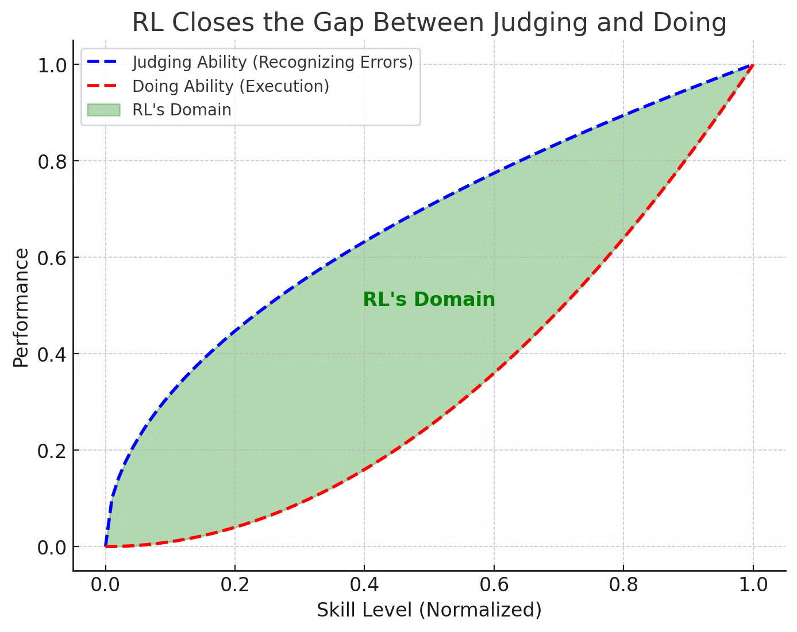
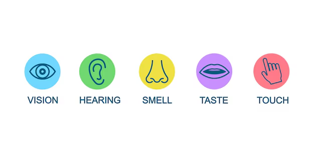
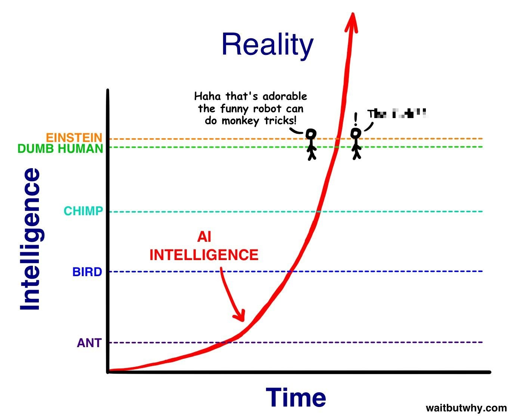
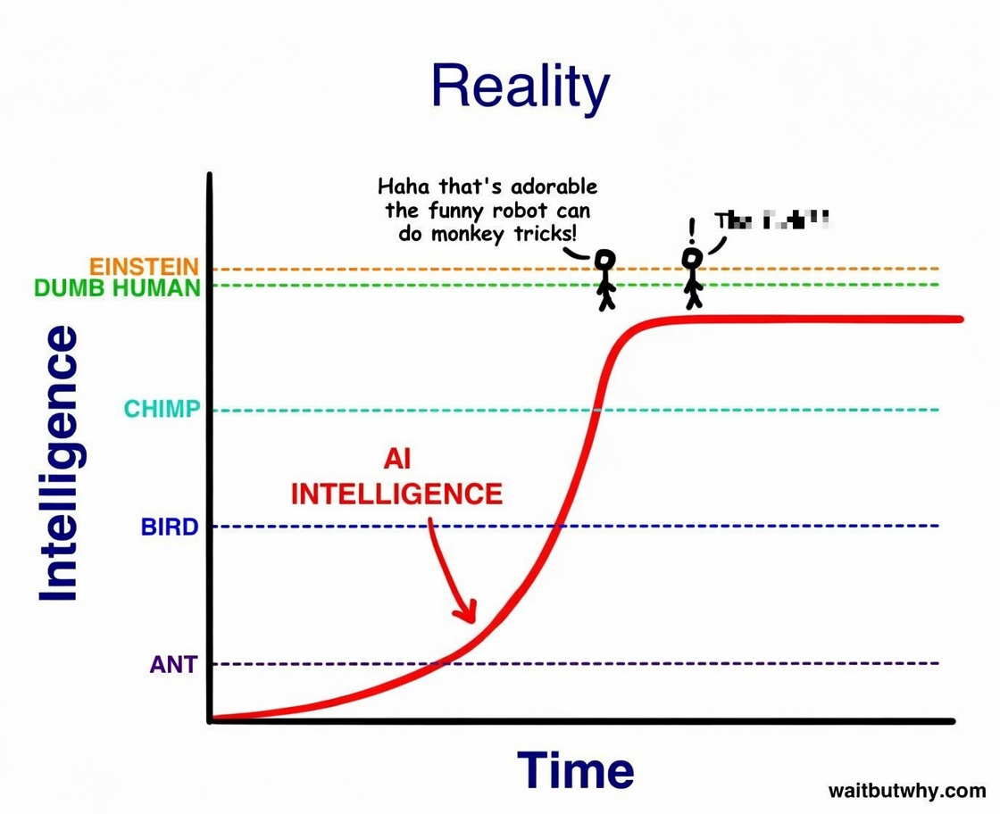
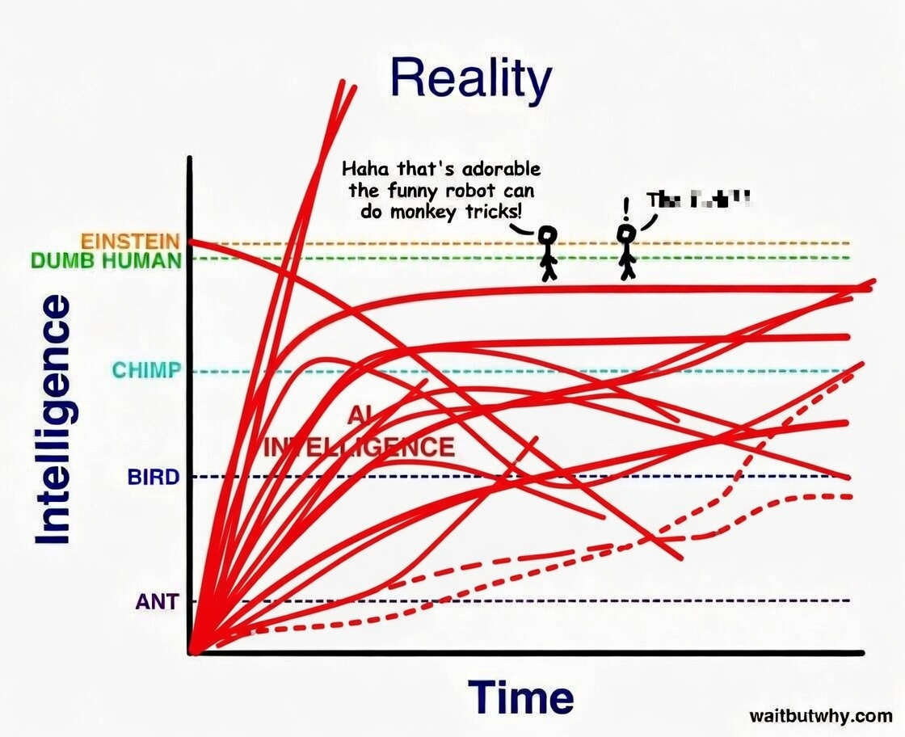

# Presentation Goals
[Jump to draft section](iterative_full_draft.md#iteration-1---presentation-goals)

## What are we doing here
- Calibrate expectations
- Recognize different perspectives
- Defeat polarization through learning

## What are we NOT doing
- Philosophy: AGI, singularity, or politics.
- Deep technical dive

## About Me

Why not listen to me?
- I am only one person
- I am not an expert in ML
- I have a long history of being fooled
- AI is a rapidly evolving frontier

Why listen to me?
- I am skeptical, curious, and disagreeable
- I am admitting a long history of being fooled
- I am a huge enthusiast with:
  - little personal responsibilities
  - heavy attraction to opposing viewpoints
  - strong aversion to unfounded doomerism/utopian thinking

# What is an LLM

Token
- Chunk of text defined by tokenizer (short word, syllable/subword, punctuation)
- Unit of measure for input, processing, output
- Analogous to "lexical" step taken by compilers
- Mapped to vectors of floating point numbers

Large Language Model (LLM)
- Predicts probability distribution over next token
- Neural network based on transformer model
- Composed of layers with billions of floating point numbers (weights)
- Nondeterministic behavior

Pre-Training
- Imperfect language word/structure patterns: "how to sound normal"
- Uses input data to determine weights for language and structural patterns
- Crunches trillions of tokens
- Data quality and selection is critical

Post Training
- Optimizing to follow human instructions aligning with human preferences
- Don't answer "what was said", give me "what response was intended"
- Shapes accuracy, tone, and formatting in specific domains
- Includes: 
    - Reinforcement learning from human feedback (RLHF)
    - Safety constraints (e.g. output classifiers)

Inference
- Actual use of a model at runtime
- Text -> Token encoding -> Iterative Neural Network Loop -> Sampling/Decoding -> Output text

Context Window
- Managed "working memory" through attentive sliding token buffer
- The effective "session state" including input + generated tokens
- Recent or "identified as practical tokens are more influential"

# Why Now?

Three stars aligned
1. Cloud infrastructure deployed at scale
2. GPU/TPU hardware improvements
3. Breakthrough in neural networks - Transformer architecture

# Who?

Primary US players
- Claude - Opus, Sonnet, Haiku (Mythos?)
- OpenAI - ChatGPT
- Google - Gemini
- xAI - Grok
- Meta - Llama

China
- DeepSeek - DeepSeek v3.2/v4 (MIT license)

France
- Mistral - Mistral mMedium 3 (Apache 2.0 license)

# Predictions

Reality is often blindsiding
Predictions are often wrong
Experts disagree

### Common flavors of wrong (one or more):
- Expansion timeline
- Market segment power
- Time to develop, manufacture
- Harms/Benefits

## The "Obvious place this is going" fallacy

### Flying cars
Prediction:
Every decade since the 40s: Flying cars are coming in ____ years!

Reality:
Forever 20-30 years out, increasing skepticism

### Online Retail
Prediction: 
Nobody will go to the store!

Reality:
Up from 0.7% in 1999 to 16.7% in 2026  (ref pew research img^, up from 0.7% in 1999 to 16.7% in 2026)

### VR
Prediction:
Imminent takeover of office work, video games, media

Reality:
Narrow use for training

### More...
- Social Media will connect people
- Video games will create violence
- You won't always have a calculator
...

### What makes you so confident in your predictions, exactly?
- Risk analysis and predictions are difficult
- The field is rapidly changing - many advancements, many opinions
- AI is the most terrible, misleading rollout of any tech product in history.

# Perspective Bias
Everyone has bias
Nobody is unbiased

### Why recognize bias?
Better calibrate expectations
Apply appropriate grains of salt
Temper less warranted fears
Avoid blindsided harms

## How to recognize bias
Learn
1) What to look for
2) Who/what to listen to
3) How to smell extremes

### Don't believe headlines
- Loudest != informed
- Media selects for shock, anger, hyperbole
- Viral content washes out boring but important developments. 
- Telephone effect across layers: Engineer <-> Manager <-> Marketing
- Consider intended audience, speaker bias, technical authority
- Listen to technical experts who use more precision

## Archetypes
(Chad meme? IQ graph meme?)
Speakers can be any or all

### AI Evangelist
May be motivated by self interest
- A charlatan (NFT hype)
- Leader seeking investment
- Narcissist
- Gambler

May be expert speaking to wrong audience:
- assuming knowledgable power user
- Speak on results with very different assumptions on workflow
  - skilled at building agents
  - improved prompting techniques
  - describing paid top model performance
- more well matched expectations
- often not well communicated

How are they wrong?
- Directionally correct, but hyperbolic
- Making predictions that are partially right and wrong
- Way in front of the headlights, overly optimistic
- Speaking outside their expertise
- They live in the present

### Decel

Particular lived experience
- Sees right through hype cycles
- Has made well placed criticisms based on bad expectations 
- 'it failed so it must be the tool' (not me!).
- The loud AI pushers (all I'm hearing) are lying so it must all be wrong
- Relies on long past observations, may set arbitrary limits on capability without looking

Personal preferences
- Strongly favors deterministic systems.
- Offended by AI syncophancy (is evidence it doesn't know things)
- Generally incurious about best practices, dismissive
- Unwilling to understand the shortcomings/limitations to calibrate use. 
- Feels threatened, may not admit it.

How are they wrong?
- The optimal solution is rarely an early iteration
- Problems come up 
- "Boy who cried wolf" encourages entrenches positions

### Dancing Monkey
- It's the monkey, not the dancing
- Low bar to impress
- Much better dancing exists

**AI Evangelist Prediction**

**Decel Prediction**

**My Prediction**

## What drives bias?
- Evaluating consequences and contextualization of a problem is highly subjective
: rate of quality or volume in each direction.

### Exposure level matters
- Time makes familiarity and informs expectations
- Direct use improves skill in using a tool more appropriately and effectively
- Enthusiasts use paid models
- Skeptics use free models

### Immediate Environment
- Informational asymmetry in exposure to diverse viewpoints
- Workplace, family, freind circle, Media diet
These all influence the observed success or failures. (or brainwashing)
- Trends in immediate bubble vary 
- What are the people and situations most frequently interacted with?

- Differences in respect or deference to perceived TRUE authority, while informed experts may reasonably disagree or change positions over time

Experts disagree
- This requires a lot of time, effort, and critical thinking to deeply understand. 

### Source Bias

Statistics are questioned
- How did who collect what data?
- How much data and where and when?
- Was there selection bias or p-hacking?
- Has this been replicated?

Whitepaper abstract summaries
- What can actually be concluded by the data?
- What exactly is the proportional impact of all of these interconnected causal or correlated factors?
- Any missing controls?
- Conclusions may exclude stronger explanations

Benchmarks:
  - Inexact.
  - Hackable.
  - Still directionally useful across sets.

### Stop Using Human Language

**Why?**
- Misleading not cute
- Anthromorphic descriptions distort expectation
- Poorly matched expectations are at best annoying

**How?**
| NO | YES |
|----|-----|
| "he or she" | "It" |
| "thinking" | "Iterative processing" |
| "having a conversation" | "Generating a transcript role playing some desired viewpoint" |

# Limitations
[Jump to draft section](iterative_full_draft.md#iteration-4---limitations)

## Ceilings

What it does, what it doesn't:
- Non-deterministic behavior.
- Weak at math, logic, reasoning.
- Hallucination causes:
  - Limited context window.
  - Insufficient confidence assessment.
- Sycophancy:
  - "World traveler" problem.
  - Cost of being wrong and confident.
- Domain knowledge is irreplaceable for evaluation.
- Benchmarks:
  - Inexact.
  - Hackable.
  - Still directionally useful across sets.
- Volume of training data affects what appears in models.

# How to Use More Effectively
[Jump to draft section](iterative_full_draft.md#iteration-5---how-to-use-more-effectively)

Three primary mindsets
1) Vibe coding 
2) Augmented learning
3) Genuine enthusiast

You can slide between, it's allowed
You don't have to, but knowing helps

### Vibe Coding
What?
- Not looking at code
- Running fast, parallel agents
- May lack expertise to evaluate
- Stop when it works

When?
- Curious but not _that_ curious
- Accuracy or performance not be critical
- May have minimal impact if right or wrong
- Interfaces are good, sufficient testing exists

### Augmented learning
What?
- Do not stop when it works; stop when you understand.
- Assume junior engineer capability; do not blindly trust.
- Curious but search engines stuck

When
- Lack base knowledge and time, search engines suck
- Ask for steps and reasoning.
    

### Genuine enthusiast
What?
- Enjoys the act of asking - "Try it again!"
- Asks how the prompt could have been better.
- Iterate on the plan before taking action.
- Constantly trying new tools, techniques
- In it for the love of the game

When?
- Want better outputs over time
- Don't want to get left behind
- Time and patience to waste on emerging technology
- It can feel addictive; writing by hand may feel painful, but preserves capability.

--------------------------------------------------------------

# Prompt Engineering
[Jump to draft section](iterative_full_draft.md#iteration-6---prompt-engineering)

- Use fewer tokens for higher information density.
- Avoid "dead zone" prompt drift:
  - Plan A derails 
  - Midstream mind changes pollute context.
- Write prompts like high-quality Jira tickets:
  - No assumptions.
  - Unambiguous and specific.
  - Include examples.
- Tone options:
  - Spartan.
  - Caveman.
  - Researcher.
  - Industry terms.
  - Medium polite.
  - Third person.
- Find the Goldilocks zone:
  - Brief and direct.
  - Add relevant constraints and examples.
- Give an out when unknown:
  - Ask for sources.
  - Ask for confidence level.
- Avoid leading tone; request balanced comparison.
- Avoid contradiction-heavy summaries:
  - Wastes tokens.
  - Adds little value.
- Prompt ordering:
  - Put the question first.
- Use paid models where appropriate:
  - Value your time.
  - Do not bazooka a fly.
- Try modalities:
  - Add picture or song to enrich narrative.

# Risks
[Jump to draft section](iterative_full_draft.md#iteration-7---risks)

- Cybersecurity:
  - Faster zero-day discovery.
  - Faster cat-and-mouse cycle.
- Bug bounty and application spam overload.
- Inappropriate use cases:
  - Psychology (human isolation risk).
  - Defense, finance, and manufacturing (cannot fail).
  - Fabricated legal cases.
  - PII exposure.
- Jailbreaking:
  - Universal vs targeted.
  - Constitutional classifiers add compute cost.
- May reflect gender/race bias from training data.
- Reviews can over-prioritize specific concerns; stay aware.

# Long-Term Impacts
[Jump to draft section](iterative_full_draft.md#iteration-8---long-term-impacts)

- Software cost plummets.
  - Graph themes: "more code," "cost per SLOC down," "quality per line down," "KPIs up."
- In less critical applications:
  - Already some slop but "good enough" (daily SQL automation, low-traffic sites).
  - More empowered refactors; stretch goals feel closer.
- Writing code by hand becomes like guitar:
  - Skill remains.
  - More hobby/craft energy.
- More time in high-level thinking than syntax.
- Accelerated learning/training:
  - Less negative learning.
  - Data is more accessible with context.
- Critical industries adopt more slowly.
- CEO lock-in risk.
- Lower moat effects:
  - Bring domain knowledge closer to implementation.
  - Break silos.
  - Encourage curiosity.
  - Experience can become a disability; conventional wisdom can become a barrier.
- Eventual ceiling:
  - Data limits (Stack Overflow, legal, ethical).
  - Hardware limits.
  - Algorithmic blockers.
- Strong use cases:
  - Improved medical imaging.
  - Doctors spend more time with people than data entry.
